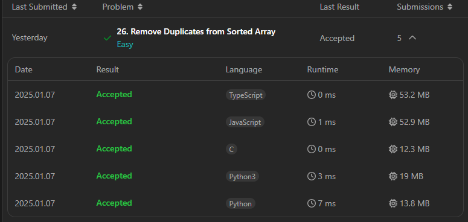

## Remove Duplicates from Sorted Array

problem link => [https://leetcode.com/problems/remove-duplicates-from-sorted-array/description/?envType=study-plan-v2&envId=top-interview-150](https://leetcode.com/problems/remove-duplicates-from-sorted-array/description/?envType=study-plan-v2&envId=top-interview-150)

Given an integer array `nums` sorted in **non-decreasing order**, remove the duplicates [**in-place**](https://en.wikipedia.org/wiki/In-place_algorithm) such that each unique element appears only **once**. The **relative order** of the elements should be kept the **same**. Then return _the number of unique elements in_ `nums`.

Consider the number of unique elements of `nums` to be `k`, to get accepted, you need to do the following things:

*   Change the array `nums` such that the first `k` elements of `nums` contain the unique elements in the order they were present in `nums` initially. The remaining elements of `nums` are not important as well as the size of `nums`.
*   Return `k`.

**Custom Judge:**

The judge will test your solution with the following code:

int\[\] nums = \[...\]; // Input array int\[\] expectedNums = \[...\]; // The expected answer with correct length int k = removeDuplicates(nums); // Calls your implementation assert k == expectedNums.length; for (int i = 0; i \< k; i++) {    assert nums\[i\] == expectedNums\[i\]; }

If all assertions pass, then your solution will be **accepted**.

**Example 1:**

**Input:** nums = \[1,1,2\] **Output:** 2, nums = \[1,2,\_\] **Explanation:** Your function should return k = 2, with the first two elements of nums being 1 and 2 respectively. It does not matter what you leave beyond the returned k (hence they are underscores).

**Example 2:**

**Input:** nums = \[0,0,1,1,1,2,2,3,3,4\] **Output:** 5, nums = \[0,1,2,3,4,\_,\_,\_,\_,\_\] **Explanation:** Your function should return k = 5, with the first five elements of nums being 0, 1, 2, 3, and 4 respectively. It does not matter what you leave beyond the returned k (hence they are underscores).

**Constraints:**

*   `1 <= nums.length <= 3 * 104`
*   `-100 <= nums[i] <= 100`
*   `nums` is sorted in **non-decreasing** order.

## Problem Approach:

1.  **Two Pointers**:
    *   Use a slow pointer (`k`) to mark the position of the last unique element.
    *   Use a fast pointer (`i`) to iterate through the array:
        *   If the current element `nums[i]` is different from `nums[k]`:
            *   Increment `k`.
            *   Copy `nums[i]` to `nums[k]`.
2.  At the end, the first `k+1` elements of `nums` will be the unique elements.
3.  Return `k+1` as the count of unique elements.

### Python Solution:

```python
def removeDuplicates(nums):
    if not nums:
        return 0  # If the array is empty, return 0
    
    k = 0  # Pointer to the last unique element
    for i in range(1, len(nums)):
        if nums[i] != nums[k]:  # Found a new unique element
            k += 1  # Move the pointer
            nums[k] = nums[i]  # Place the unique element at position k
    return k + 1  # Return the count of unique elements

# Example Usage:
nums = [0, 0, 1, 1, 1, 2, 2, 3, 3, 4]
k = removeDuplicates(nums)
print("Output:", k, ", nums =", nums[:k])  # Output: 5 , nums = [0, 1, 2, 3, 4]
```

### JavaScript Solution:

```javascript
var removeDuplicates = function(nums) {
    if (nums.length === 0) return 0; // Handle empty array case
    
    let k = 0; // Pointer to the last unique element
    for (let i = 1; i < nums.length; i++) {
        if (nums[i] !== nums[k]) { // Found a new unique element
            k++; // Move the pointer
            nums[k] = nums[i]; // Place the unique element at position k
        }
    }
    return k + 1; // Return the count of unique elements
};

// Example Usage:
let nums = [1, 1, 2];
let k = removeDuplicates(nums);
console.log("Output:", k, ", nums =", nums.slice(0, k)); // Output: 2 , nums = [1, 2]
```

### TypeScript Solution:

```typescript
function removeDuplicates(nums: number[]): number {
    if (nums.length === 0) return 0; // Handle empty array case
    
    let k = 0; // Pointer to the last unique element
    for (let i = 1; i < nums.length; i++) {
        if (nums[i] !== nums[k]) { // Found a new unique element
            k++; // Move the pointer
            nums[k] = nums[i]; // Place the unique element at position k
        }
    }
    return k + 1; // Return the count of unique elements
}

// Example Usage:
let nums: number[] = [0, 0, 1, 1, 1, 2, 2, 3, 3, 4];
let k: number = removeDuplicates(nums);
console.log("Output:", k, ", nums =", nums.slice(0, k)); // Output: 5 , nums = [0, 1, 2, 3, 4]
```

### C Solution:

```c
#include <stdio.h>

int removeDuplicates(int* nums, int numsSize) {
    if (numsSize == 0) return 0; // Handle empty array case
    
    int k = 0; // Pointer to the last unique element
    for (int i = 1; i < numsSize; i++) {
        if (nums[i] != nums[k]) { // Found a new unique element
            k++; // Move the pointer
            nums[k] = nums[i]; // Place the unique element at position k
        }
    }
    return k + 1; // Return the count of unique elements
}

// Example Usage:
int main() {
    int nums[] = {0, 0, 1, 1, 1, 2, 2, 3, 3, 4};
    int numsSize = sizeof(nums) / sizeof(nums[0]);
    
    int k = removeDuplicates(nums, numsSize);
    printf("Output: %d, nums = [", k);
    for (int i = 0; i < k; i++) {
        printf("%d%s", nums[i], i == k - 1 ? "]\n" : ", ");
    }
    return 0;
}
```

### Complexity Analysis:

1.  **Time Complexity**: O(n)O(n)O(n)
    *   Each element of the array is visited once, so the time complexity is linear.
2.  **Space Complexity**: O(1)O(1)O(1)
    *   The solution is done in-place, using constant extra space.

### Test Cases:

#### Example 1:

plaintext

Copy code

```plaintext
Input: nums = [1, 1, 2]
Output: 2, nums = [1, 2, _]
```

#### Example 2:

plaintext

Copy code

```plaintext
Input: nums = [0, 0, 1, 1, 1, 2, 2, 3, 3, 4]
Output: 5, nums = [0, 1, 2, 3, 4, _, _, _, _, _]
```

#### Example 3:

plaintext

Copy code

```plaintext
Input: nums = []
Output: 0
```
