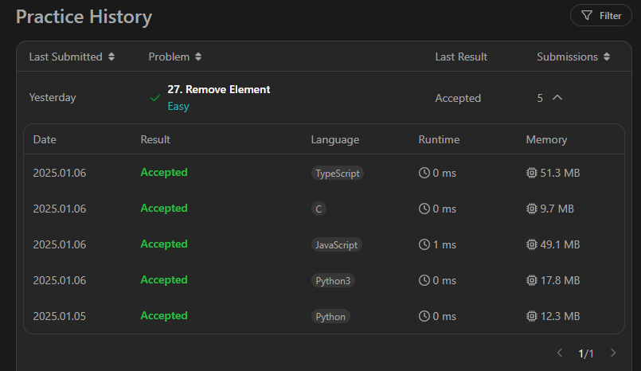

## [**Remove Element**](https://leetcode.com/problems/remove-element/)

problem link [https://leetcode.com/problems/remove-element/description/?envType=study-plan-v2&envId=top-interview-150](https://leetcode.com/problems/remove-element/description/?envType=study-plan-v2&envId=top-interview-150)

problem 

  Given an integer array `nums` and an integer `val`, remove all occurrences of `val` in `nums` [**in-place**](https://en.wikipedia.org/wiki/In-place_algorithm). The order of the elements may be changed. Then return _the number of elements in_ `nums` _which are not equal to_ `val`.

Consider the number of elements in `nums` which are not equal to `val` be `k`, to get accepted, you need to do the following things:

*   Change the array `nums` such that the first `k` elements of `nums` contain the elements which are not equal to `val`. The remaining elements of `nums` are not important as well as the size of `nums`.
*   Return `k`.

**Custom Judge:**

The judge will test your solution with the following code:

int\[\] nums = \[...\]; // Input array int val = ...; // Value to remove int\[\] expectedNums = \[...\]; // The expected answer with correct length.                            // It is sorted with no values equaling val. int k = removeElement(nums, val); // Calls your implementation assert k == expectedNums.length; sort(nums, 0, k); // Sort the first k elements of nums for (int i = 0; i \< actualLength; i++) {    assert nums\[i\] == expectedNums\[i\]; }

If all assertions pass, then your solution will be **accepted**.

**Example 1:**

**Input:** nums = \[3,2,2,3\], val = 3 **Output:** 2, nums = \[2,2,\_,\_\] **Explanation:** Your function should return k = 2, with the first two elements of nums being 2. It does not matter what you leave beyond the returned k (hence they are underscores).

**Example 2:**

**Input:** nums = \[0,1,2,2,3,0,4,2\], val = 2 **Output:** 5, nums = \[0,1,4,0,3,\_,\_,\_\] **Explanation:** Your function should return k = 5, with the first five elements of nums containing 0, 0, 1, 3, and 4. Note that the five elements can be returned in any order. It does not matter what you leave beyond the returned k (hence they are underscores).

**Constraints:**

*   `0 <= nums.length <= 100`
*   `0 <= nums[i] <= 50`
*   `0 <= val <= 100`

## Problem Approach:

The problem asks to remove all occurrences of a given value `val` from the array `nums` **in-place**, and return the number of elements remaining (`k`).

### Steps:

1.  **Two-Pointer Technique**:
    *   Use one pointer (`k`) to track the next position in the array to store a value not equal to `val`.
    *   Iterate through the array using a second pointer (`i`), checking each element:
        *   If the current element is **not equal to** `**val**`, copy it to the `k`\-th position and increment `k`.
2.  At the end of the loop, the first `k` elements in the array will be the elements not equal to `val`.
3.  Return `k`.

### Python Solution:

```python
def removeElement(nums, val):
    k = 0  # Pointer for placement of elements not equal to val
    for num in nums:
        if num != val:  # Check if the current number is not equal to val
            nums[k] = num  # Place the number at position k
            k += 1  # Increment k
    return k

# Example Usage:
nums = [3, 2, 2, 3]
val = 3
k = removeElement(nums, val)
print("Output:", k, ", nums =", nums[:k])  # Output: 2 , nums = [2, 2]
```

### Python 3 Solution (Same Logic):

The code for Python 3 is identical to the Python solution:

```python
def removeElement(nums, val):
    k = 0
    for num in nums:
        if num != val:
            nums[k] = num
            k += 1
    return k

# Example Usage:
nums = [0, 1, 2, 2, 3, 0, 4, 2]
val = 2
k = removeElement(nums, val)
print("Output:", k, ", nums =", nums[:k])  # Output: 5 , nums = [0, 1, 3, 0, 4]
```

### JavaScript Solution:

```javascript
var removeElement = function(nums, val) {
    let k = 0; // Pointer to track placement
    for (let i = 0; i < nums.length; i++) {
        if (nums[i] !== val) { // Check if current element is not val
            nums[k] = nums[i]; // Place element at position k
            k++;
        }
    }
    return k; // Return count of elements not equal to val
};

// Example Usage:
let nums = [3, 2, 2, 3];
let val = 3;
let k = removeElement(nums, val);
console.log("Output:", k, ", nums =", nums.slice(0, k)); // Output: 2 , nums = [2, 2]
```

### TypeScript Solution:

```typescript
function removeElement(nums: number[], val: number): number {
    let k = 0; // Pointer to track placement
    for (let i = 0; i < nums.length; i++) {
        if (nums[i] !== val) { // Check if current element is not val
            nums[k] = nums[i]; // Place element at position k
            k++;
        }
    }
    return k; // Return count of elements not equal to val
}

// Example Usage:
let nums: number[] = [0, 1, 2, 2, 3, 0, 4, 2];
let val: number = 2;
let k: number = removeElement(nums, val);
console.log("Output:", k, ", nums =", nums.slice(0, k)); // Output: 5 , nums = [0, 1, 3, 0, 4]
```

### C Solution:

```c
#include <stdio.h>

int removeElement(int* nums, int numsSize, int val) {
    int k = 0; // Pointer to track placement
    for (int i = 0; i < numsSize; i++) {
        if (nums[i] != val) { // Check if current element is not val
            nums[k] = nums[i]; // Place element at position k
            k++;
        }
    }
    return k; // Return count of elements not equal to val
}

// Example Usage:
int main() {
    int nums[] = {0, 1, 2, 2, 3, 0, 4, 2};
    int numsSize = sizeof(nums) / sizeof(nums[0]);
    int val = 2;

    int k = removeElement(nums, numsSize, val);
    printf("Output: %d, nums = [", k);
    for (int i = 0; i < k; i++) {
        printf("%d%s", nums[i], i == k - 1 ? "]\n" : ", ");
    }
    return 0;
}
```

### Example Test Cases:

#### Input:

```plaintext
nums = [3, 2, 2, 3], val = 3
```

#### Output:

```plaintext
k = 2, nums = [2, 2]
```

#### Input:

```plaintext
nums = [0, 1, 2, 2, 3, 0, 4, 2], val = 2
```

#### Output:

```plaintext
k = 5, nums = [0, 1, 3, 0, 4]
```

### Complexity Analysis:

*   **Time Complexity:** O(n)O(n)O(n), where nnn is the size of the array. Each element is processed once.
*   **Space Complexity:** O(1)O(1)O(1), as the solution operates in-place without requiring additional space.

